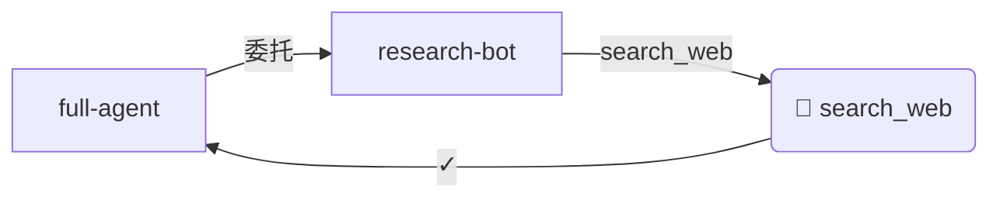

# myExtBot

myExtBot is a digital avatar asset system built around a Multi-Agent Pipeline architecture.
Each agent can delegate tool calls to other agents, and every delegation is logged for traceability.

---

## Asset Lineage Graph (M9)

### 概念 / What is a Lineage Graph?

血缘图（Lineage Graph）将每一条 `DelegationLogEntry` 转化为有向调用图。
它把整条 Agent 调用链路从「黑盒」变成「透明玻璃」——每一步的输入输出、谁委托了谁，都清晰可见。

A lineage graph turns every `DelegationLogEntry` into a directed call graph, making the full
Agent invocation chain transparent and traceable from "black box" to "glass box".

### 使用场景 / Use Cases

- **调试 Pipeline 失败**：快速定位哪个 Agent/工具调用失败
- **性能优化**：通过 `durationMs` 找出瓶颈节点
- **审计合规**：完整记录每次 Agent 委托行为
- **文档生成**：自动生成 GitHub Issue/PR 中的流程图

### Quick Start

```typescript
import { McpServiceListManager } from "./core/McpServiceListManager";

const manager = new McpServiceListManager();
// ... register services ...

// Generate some delegations
await manager.delegateAs("full-agent", "research-bot", {
  toolName: "search_web",
  arguments: { query: "lineage graph patterns" }
});

// Build and export the graph
const graph = manager.buildLineageGraph();
console.log(graph.nodeCount, graph.edgeCount);

const mermaid = manager.exportLineageMermaid();
console.log(mermaid);
// graph LR
//   agent_full-agent["full-agent"] --> |委托| agent_research-bot["research-bot"]
//   ...
```

### REST API

Start the server:
```bash
npm run server
```

| Endpoint | Method | Description |
|----------|--------|-------------|
| `/api/lineage` | GET | Full graph (JSON by default; `?format=mermaid` or `?format=dot`) |
| `/api/lineage/mermaid` | GET | Mermaid flowchart text (`text/plain`) |
| `/api/lineage/summary` | GET | Summary statistics |

#### Example: Get Mermaid graph for a time range

```bash
curl "http://localhost:3000/api/lineage/mermaid?startTime=2024-01-01T00:00:00Z&endTime=2024-12-31T23:59:59Z"
```

#### Example: Summary

```bash
curl "http://localhost:3000/api/lineage/summary"
# {
#   "totalNodes": 5,
#   "totalEdges": 6,
#   "agentNodes": ["full-agent", "research-bot", "dev-bot"],
#   "toolNodes": ["search_web", "run_code"],
#   "successRate": 1,
#   "timeRange": { "earliest": "...", "latest": "..." }
# }
```

### Embed Mermaid in GitHub Issues / Markdown

Paste the output of `/api/lineage/mermaid` into a GitHub Issue or Markdown file:

````markdown

````

GitHub will automatically render it as an interactive diagram.

### 关联模块 / Related Modules

- 📎 **M1（DelegationLog 持久化）**：血缘图的数据来源——没有持久化的 Log 就没有可重放的血缘图
- 📎 **M3（Multi-Agent Pipeline）**：Pipeline 的链式调用天然形成树状血缘图，是最直接的可视化场景

### Export Formats

| Format | Method | Description |
|--------|--------|-------------|
| JSON | `exportLineageJSON()` | Structured graph data for frontend rendering |
| Mermaid | `exportLineageMermaid()` | Paste directly into GitHub/MD for rendering |
| DOT | `exportLineageDOT()` | Graphviz format for advanced visualization |
