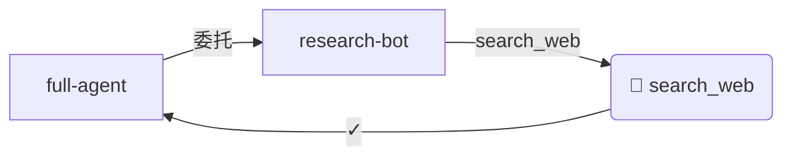

# myExtBot

**myExtBot** is a digital twin asset system that lets you dynamically equip your bot with skills (plugins) at runtime — no restarts required.

---

## Quick Start

```bash
npm install
npm run dev
```

---

## Plugin Marketplace

### Overview

Skills are like phone apps: install them when you need them, uninstall them when you don't. The Plugin Marketplace lets you extend myExtBot's capabilities at runtime without touching code.

### REST API

All endpoints are prefixed with `/api/plugins`.

| Method   | Path                        | Description                                      |
|----------|-----------------------------|--------------------------------------------------|
| `GET`    | `/api/plugins`              | List all marketplace plugins (with install status) |
| `GET`    | `/api/plugins/installed`    | List only installed plugins                      |
| `GET`    | `/api/plugins/:id`          | Get details for a single plugin                  |
| `POST`   | `/api/plugins/:id/install`  | Install a plugin                                 |
| `DELETE` | `/api/plugins/:id/uninstall`| Uninstall a plugin                               |

#### Example — install `weather-service`

```bash
curl -X POST http://localhost:3000/api/plugins/weather-service/install
```

```json
{
  "success": true,
  "message": "Plugin 'weather-service' installed successfully.",
  "plugin": {
    "id": "weather-service",
    "name": "Weather Service",
    "version": "1.0.0",
    "installed": true,
    "tools": [{ "name": "get_weather", ... }]
  }
}
```

#### Example — uninstall

```bash
curl -X DELETE http://localhost:3000/api/plugins/weather-service/uninstall
```

### `data/marketplace-index.json` Format

The marketplace catalogue is a JSON array of **PluginManifest** objects:

```json
[
  {
    "id": "my-plugin",
    "name": "My Plugin",
    "version": "1.0.0",
    "author": "you",
    "description": "What this plugin does.",
    "category": "Utilities",
    "registryUrl": "local://my-plugin",
    "executeEndpoint": "https://api.example.com/my-plugin/execute",
    "tools": [
      {
        "name": "my_tool",
        "description": "Description of the tool.",
        "parameters": {
          "type": "object",
          "properties": {
            "input": { "type": "string", "description": "Input text." }
          },
          "required": ["input"]
        }
      }
    ]
  }
]
```

### Adding a Custom Plugin

1. Edit `data/marketplace-index.json` and add a new entry following the format above.
2. If your plugin connects to a real external API, set `executeEndpoint` to the HTTP endpoint that accepts `{ toolName, parameters }` POST requests.
3. Install via the REST API or programmatically:

```typescript
const installer = new PluginInstaller(manager, new PluginRegistry());
await installer.install("my-plugin");
```

### Using `executeEndpoint`

When `executeEndpoint` is set, `PluginService` forwards every tool call as an HTTP POST:

```
POST https://api.example.com/my-plugin/execute
Content-Type: application/json

{
  "toolName": "my_tool",
  "parameters": { "input": "hello" }
}
```

The response body is returned as the tool result. If `executeEndpoint` is omitted, a stub result is returned (useful for local development and testing).

### Persistence & Restart Recovery

Installed plugins are persisted to `data/installed-plugins.json`. On the next startup, `PluginInstaller.restoreInstalled()` re-registers all previously installed plugins automatically.

> **Note:** `data/installed-plugins.json` is excluded from git (user state). `data/marketplace-index.json` is committed (shared catalogue).

Override the data directory with the `MYEXTBOT_DATA_DIR` environment variable:

```bash
MYEXTBOT_DATA_DIR=/custom/path npm run dev
myExtBot — Digital Avatar Asset System (数字分身资产体系)

A TypeScript framework for managing AI service agents with health monitoring,
fallback routing, delegation logging, and plugin extensibility.
> **Digital Avatar Asset System** — A TypeScript framework for building multi-agent pipelines where each agent owns its tools as sovereign assets.

---

## Table of Contents

- [Overview](#overview)
- [Quick Start](#quick-start)
- [Core Concepts](#core-concepts)
- [Multi-Agent Pipelines](#multi-agent-pipelines)
- [REST API](#rest-api)
- [Architecture Roadmap](#architecture-roadmap)

---

## Overview

myExtBot is built around the philosophy that **Agents, Tools, and Services are digital assets you own** — not just utility functions.  Every delegation between agents is logged, every pipeline run is traceable, and every tool call is attributed to its owner.
myExtBot is a digital avatar asset system built around a Multi-Agent Pipeline architecture.
Each agent can delegate tool calls to other agents, and every delegation is logged for traceability.

---

## Asset Lineage Graph (M9)

### 概念 / What is a Lineage Graph?

血缘图（Lineage Graph）将每一条 `DelegationLogEntry` 转化为有向调用图。
它把整条 Agent 调用链路从「黑盒」变成「透明玻璃」——每一步的输入输出、谁委托了谁，都清晰可见。

A lineage graph turns every `DelegationLogEntry` into a directed call graph, making the full
Agent invocation chain transparent and traceable from "black box" to "glass box".

### 使用场景 / Use Cases

- **调试 Pipeline 失败**：快速定位哪个 Agent/工具调用失败
- **性能优化**：通过 `durationMs` 找出瓶颈节点
- **审计合规**：完整记录每次 Agent 委托行为
- **文档生成**：自动生成 GitHub Issue/PR 中的流程图

### Quick Start

```typescript
import { McpServiceListManager } from "./core/McpServiceListManager";

const manager = new McpServiceListManager();
// ... register services ...

// Generate some delegations
await manager.delegateAs("full-agent", "research-bot", {
  toolName: "search_web",
  arguments: { query: "lineage graph patterns" }
});

// Build and export the graph
const graph = manager.buildLineageGraph();
console.log(graph.nodeCount, graph.edgeCount);

const mermaid = manager.exportLineageMermaid();
console.log(mermaid);
// graph LR
//   agent_full-agent["full-agent"] --> |委托| agent_research-bot["research-bot"]
//   ...
myExtBot is a digital avatar (数字分身) asset system built on TypeScript/Node.js.
It models **Scenes** — named collections of services — and provides a trigger
engine that automatically recommends the most relevant Scene based on runtime
context.

---

## Getting Started

```bash
npm install
npm run dev     # runs src/index.ts (demo)
npm run build   # compile TypeScript → dist/
npm start       # start the REST server
```

---

## Scene Triggers

**M7 — Responsive Scene Auto-Detection**

Users should never have to manually switch modes. The `SceneTriggerEngine`
evaluates each Scene's declared trigger conditions against the current runtime
context and surfaces the best match automatically.

### Trigger Types

| Type | Description | Key field(s) |
|------|-------------|--------------|
| `keyword` | Fires when the user's input contains one or more of the listed keywords (case-insensitive). | `keywords: string[]` |
| `time` | Fires when the current local time falls within a HH:MM range. Supports overnight ranges (e.g. `22:00`–`06:00`). | `timeRange: { start, end }` |
| `agent` | Fires when a specific Agent is currently being invoked. | `agentId: string` |
| `health` | Fires when the service health map satisfies a condition. | `condition: "any-service-down" \| "all-services-healthy"` |

### Trigger Weights

Weights control how confidently a trigger recommends a Scene.
The final score for a Scene is the sum of weights of all matching triggers.

| Trigger type | Weight | Rationale |
|---|---|---|
| `health` | **4** | System anomalies are highest priority |
| `keyword` | **3** | Most direct expression of user intent |
| `agent` | **2** | Current agent provides strong context |
| `time` | **1** | Background condition, lowest priority |

### TriggerContext Fields

```typescript
interface TriggerContext {
  userInput?:      string;                          // for keyword triggers
  currentTime?:    string;                          // HH:MM, defaults to now
  activeAgentId?:  string;                          // for agent triggers
  serviceHealths?: Record<string, ServiceHealth>;   // for health triggers
}
```

### Registering a Scene with Triggers

```typescript
manager.registerScene({
  id: "research-triggered",
  name: "Research (with triggers)",
  description: "Auto-activates when user wants to search for information.",
  serviceNames: ["SearchService"],
  triggers: [
    { type: "keyword", keywords: ["搜索", "search", "find", "research"] },
    { type: "time",    timeRange: { start: "08:00", end: "20:00" } },
  ],
});
```

### Programmatic Auto-Detection

```typescript
// All matching scenes (ranked by score)
const suggestions = manager.autoDetectScene({ userInput: "帮我搜索一下" });
// → [{ sceneId: "research-triggered", score: 3, matchedTriggers: [...] }]

// Single best match
const best = manager.bestSceneForContext({ userInput: "search for news" });
// → "research-triggered"
```

### REST API

Start the server:
```bash
npm run server
```

| Endpoint | Method | Description |
|----------|--------|-------------|
| `/api/lineage` | GET | Full graph (JSON by default; `?format=mermaid` or `?format=dot`) |
| `/api/lineage/mermaid` | GET | Mermaid flowchart text (`text/plain`) |
| `/api/lineage/summary` | GET | Summary statistics |

#### Example: Get Mermaid graph for a time range

```bash
curl "http://localhost:3000/api/lineage/mermaid?startTime=2024-01-01T00:00:00Z&endTime=2024-12-31T23:59:59Z"
```

#### Example: Summary

```bash
curl "http://localhost:3000/api/lineage/summary"
# {
#   "totalNodes": 5,
#   "totalEdges": 6,
#   "agentNodes": ["full-agent", "research-bot", "dev-bot"],
#   "toolNodes": ["search_web", "run_code"],
#   "successRate": 1,
#   "timeRange": { "earliest": "...", "latest": "..." }
# }
```

### Embed Mermaid in GitHub Issues / Markdown

Paste the output of `/api/lineage/mermaid` into a GitHub Issue or Markdown file:

````markdown

````

GitHub will automatically render it as an interactive diagram.

### 关联模块 / Related Modules

- 📎 **M1（DelegationLog 持久化）**：血缘图的数据来源——没有持久化的 Log 就没有可重放的血缘图
- 📎 **M3（Multi-Agent Pipeline）**：Pipeline 的链式调用天然形成树状血缘图，是最直接的可视化场景

### Export Formats

| Format | Method | Description |
|--------|--------|-------------|
| JSON | `exportLineageJSON()` | Structured graph data for frontend rendering |
| Mermaid | `exportLineageMermaid()` | Paste directly into GitHub/MD for rendering |
| DOT | `exportLineageDOT()` | Graphviz format for advanced visualization |
#### `POST /api/scenes/auto-detect`

Returns all Scenes that match the provided context, ranked by score.

```bash
curl -X POST http://localhost:3000/api/scenes/auto-detect \
  -H "Content-Type: application/json" \
  -d '{ "userInput": "帮我搜索最新AI新闻" }'
```

Response:

```json
[
  {
    "sceneId": "research-triggered",
    "sceneName": "Research (with triggers)",
    "matchedTriggers": [
      { "type": "keyword", "reason": "关键词匹配: 搜索, 最新" },
      { "type": "time",    "reason": "时间范围匹配: 08:00 – 20:00 (当前 09:30)" }
    ],
    "score": 4
  }
]
```

#### `POST /api/scenes/best-match`

Returns only the single highest-scoring match (or `null` if nothing matches).

```bash
curl -X POST http://localhost:3000/api/scenes/best-match \
  -H "Content-Type: application/json" \
  -d '{ "userInput": "search for latest news" }'
```

Response:

```json
{
  "sceneId": "research-triggered",
  "result": {
    "sceneId": "research-triggered",
    "sceneName": "Research (with triggers)",
    "matchedTriggers": [...],
    "score": 4
  }
}
```

### Relationship with Other Modules

| Module | Integration |
|--------|-------------|
| **M4 — 资产健康度** | `health` triggers read the service health status map from HealthMonitor |
| **M6 — 分身意图声明** | `keyword` triggers share vocabulary-matching logic with AgentRouter |
| **M10 — 分身生命周期** | Agent state changes can be fed as `activeAgentId` context to trigger scene switches |

---

## Architecture

```
src/
├── core/
│   ├── types.ts                  # Scene, SceneTrigger, TriggerContext, SceneTriggerResult
│   ├── SceneTriggerEngine.ts     # Trigger evaluation logic + scoring
│   └── McpServiceListManager.ts  # Scene registry + autoDetectScene / bestSceneForContext
├── api/
│   └── sceneTriggerRoutes.ts     # Express routes: /api/scenes/auto-detect, /api/scenes/best-match
├── server.ts                     # Express app setup + demo scene registration
└── index.ts                      # CLI demo (npm run dev)
myExtBot is a **digital-persona asset system** built around the concept that an Agent is not just a set of permissions — it is a persona with character, expertise, and intent.

---

## Quick Start

```bash
npm install
npm run dev    # run the demo
npm run build  # TypeScript compile check
```

---

## Service Health Monitoring (M4)

### Overview

Every external API can fail, be rate-limited, or become unavailable.
The M4 health monitoring layer gives every Service a **visible health status**
and automatically routes calls to a fallback Service when a primary Service is
unhealthy — ensuring system resilience.

### 5 Health States

| State | Meaning | Callable? |
|---|---|---|
| `unknown` | No calls recorded yet (initial state after `register()`) | ✅ Yes |
| `healthy` | API responding normally | ✅ Yes |
| `degraded` | 3–4 consecutive failures — reduced confidence but still usable | ✅ Yes |
| `down` | 5+ consecutive failures — calls suspended | ❌ No |
| `rate-limited` | HTTP 429 received — waiting for `rateLimitResetAt` | ❌ No |

### State Transition Rules

```
register()         → "unknown"
recordSuccess()    → "healthy"  (resets consecutiveFailures to 0)
recordFailure()    (non-429):
  consecutiveFailures < 3   → stays "healthy" (transient errors don't degrade)
  consecutiveFailures >= 3  → "degraded"
  consecutiveFailures >= 5  → "down"
recordFailure()    (429 / "rate limit"):
  → "rate-limited" + sets rateLimitResetAt (Retry-After seconds)
checkRateLimitRecovery() called before every dispatch:
  if rateLimitResetAt < now → auto-recover to "healthy"
```

### Automatic Fallback Routing

Configure `fallbackServiceName` on any `BaseService` subclass:

```typescript
export class PerplexityService extends BaseService {
  readonly name = "PerplexityService";
  fallbackServiceName = "SearchService";   // ← fallback when "down" / "rate-limited"
  // ...
}
```

When `McpServiceListManager.dispatch("PerplexityService", payload)` is called
and `PerplexityService` is `"down"` or `"rate-limited"`, the manager
automatically routes to `"SearchService"` and logs a warning.

If no fallback is configured and the service is not callable, dispatch returns:

```json
{ "success": false, "error": "Service \"X\" is down, no fallback available." }
```

### REST API

Mount the health routes on your Express app:

```typescript
import { mountHealthRoutes } from "./api/healthRoutes";
mountHealthRoutes(app, manager);
```

| Method | Path | Description |
|--------|------|-------------|
| `GET` | `/api/health` | All `ServiceHealthRecord[]` |
| `GET` | `/api/health/:serviceName` | Single record |
| `POST` | `/api/health/:serviceName/reset` | Reset to `"healthy"` (ops) |

Example response for `GET /api/health/PerplexityService`:

```json
{
  "serviceName": "PerplexityService",
  "health": "degraded",
  "lastCheckedAt": "2026-03-12T08:00:00.000Z",
  "consecutiveFailures": 3,
  "lastError": "503 Service Unavailable",
  "totalCalls": 10,
  "totalSuccesses": 7,
  "successRate": 0.7
}
```

### Programmatic API

```typescript
const manager = new McpServiceListManager();
manager.register(new PerplexityService());

// Health queries
manager.getServiceHealth("PerplexityService");  // ServiceHealthRecord
manager.getAllServiceHealths();                  // ServiceHealthRecord[]

// Ops reset
manager.resetServiceHealth("PerplexityService");
```

### Integration with Other Milestones

| Milestone | Integration |
|-----------|-------------|
| **M10 — Agent Lifecycle** | When a Service is persistently `"down"`, the owning Agent can transition `active → sleeping` |
| **M8 — Agent SLA** | Timeout failures increment `consecutiveFailures`; SLA violations are tracked alongside health |
| **M7 — Scene Triggers** | A `health` trigger type reads health state to automatically switch Scenes |

---

## Architecture

```
src/
  core/
    types.ts                 ← All shared types (ServiceHealth, ServiceHealthRecord, …)
    HealthMonitor.ts         ← Health state machine
    McpServiceListManager.ts ← Central registry & health-aware dispatcher
  services/
    BaseService.ts           ← Abstract base with fallbackServiceName
    SearchService.ts         ← Mock fallback service
    PerplexityService.ts     ← AI search service (with fallback config)
  api/
    healthRoutes.ts          ← REST API handlers
  index.ts                   ← Demo entry point
npm run dev        # Run the demo (src/index.ts)
npm run server     # Start the Express REST server
npm run build      # Compile TypeScript to dist/
```

---

## Core Concepts

| Concept | Description |
|---------|-------------|
| **McpService** | A service that exposes one or more tools (e.g., SearchService, CodeRunnerService) |
| **AgentProfile** | A named agent with a set of allowed services and delegation permissions |
| **DelegationLog** | Immutable record of every tool dispatch — the agent's behaviour memory |
| **AgentPipeline** | An ordered list of steps to be executed sequentially across agents |

### Agent Registration

npm run dev       # run the routing demo (src/index.ts)
npm run server    # start the Express API server on port 3000
npx tsc --noEmit  # type-check only
```

---

## Agent Intent & Routing

> **M6 — 分身意图声明 (Agent Intent & Persona)**

### Extended `AgentProfile` Fields

| Field | Type | Description |
|---|---|---|
| `systemPrompt` | `string?` | System message injected to the LLM when running as this agent |
| `intents` | `string[]?` | Intent tags for routing (fine-grained; e.g. `"web-search"`, `"fact-check"`) |
| `domains` | `string[]?` | Domain tags (coarse-grained; e.g. `"research"`, `"coding"`) |
| `languages` | `string[]?` | Languages the agent is proficient in (e.g. `"zh-CN"`, `"en-US"`) |
| `responseStyle` | `"concise" \| "detailed" \| "bullet-points" \| "markdown"` | Preferred output style |

#### `systemPrompt` vs ordinary `description`

- **`description`** is for humans — it is displayed in UI and agent lists.
- **`systemPrompt`** is for the LLM — it is injected as the `system` message so the model stays in character throughout the conversation.

Example:
```typescript
manager.registerAgent({
  id: "research-bot",
  name: "Research Bot",
  allowedServices: ["SearchService"],
  canDelegateTo: [],
  systemPrompt: "You are a research assistant.",
  intents: ["web-search", "research"],
});
```

### Dispatching a Tool Call

```typescript
const result = await manager.dispatchAs("research-bot", {
  toolName: "search_web",
  arguments: { query: "MCP pipeline patterns", maxResults: 3 },
});
```

---

## Multi-Agent Pipelines

**M3 — Multi-Agent Pipeline** lets you declare a sequence of agent steps where each step can reference the output of a previous step.  This enables powerful A → B → C execution chains with full context propagation.

### inputMapping — Two Modes

| Mode | Example | Meaning |
|------|---------|---------|
| **Literal** | `"query": "hello world"` | The string `"hello world"` is passed directly |
| **fromStep reference** | `"code": { fromStep: 0, outputPath: "results" }` | The value at path `results` from step 0's output |

`outputPath` supports dot-notation and array indices:

```
"results[0].url"   →  first result's URL
"answer"           →  top-level key
"meta.total"       →  nested key
```

### Registering a Pipeline

```typescript
manager.registerPipeline({
  id: "research-and-summarize",
  name: "Research & Summarize",
  description: "Search the web, then process the results.",
  steps: [
    {
      agentId: "research-bot",
      toolName: "search_web",
      description: "Step 1: Search for the topic",
      inputMapping: {
        query: "MCP agent pipeline patterns",
        maxResults: "3",
      },
    },
    {
      agentId: "dev-bot",
      toolName: "run_code",
      description: "Step 2: Process the search results",
      inputMapping: {
        language: "javascript",
        code: { fromStep: 0, outputPath: "results" }, // ← reference step 0 output
      },
    },
  ],
});
```

### Running a Pipeline Programmatically

```typescript
const result = await manager.runPipeline("research-and-summarize", {});
console.log(result.success);      // true / false
console.log(result.finalOutput);  // output of the last step
console.log(result.stepResults);  // per-step details
console.log(result.failedAtStep); // set if a step failed (failFast mode)
```

### PipelineRunResult Shape

```typescript
{
  pipelineId: string;
  startedAt: string;       // ISO-8601
  completedAt: string;     // ISO-8601
  success: boolean;
  stepResults: Array<{
    stepIndex: number;
    agentId: string;
    toolName: string;
    success: boolean;
    output?: unknown;
    error?: string;
    durationMs: number;
  }>;
  finalOutput?: unknown;   // last step's output
  failedAtStep?: number;   // index of the first failed step
  error?: string;
}
```

### Integration with M1 (DelegationLog) and M9 (Lineage Graph)

Every step in a pipeline is executed via `manager.dispatchAs()`, which appends an entry to the **DelegationLog**.  The `fromAgentId` field identifies the calling agent, providing a complete audit trail:

```
research-bot → SearchService :: search_web (0ms)
dev-bot      → CodeRunnerService :: run_code (1ms)
```

This chain of log entries naturally forms the **asset lineage graph** (M9), showing exactly which agents consumed which tools and in what order.

---

## REST API

Start the server with `npm run server` (default port 3000).

| Method | Path | Description |
|--------|------|-------------|
| `GET` | `/api/pipelines` | List all registered pipelines |
| `POST` | `/api/pipelines` | Register a new pipeline |
| `GET` | `/api/pipelines/:id` | Get a pipeline by ID |
| `DELETE` | `/api/pipelines/:id` | Unregister a pipeline |
| `POST` | `/api/pipelines/:id/run` | Execute a pipeline |

### POST /api/pipelines

```json
{
  "id": "my-pipeline",
  "name": "My Pipeline",
  "steps": [
    { "agentId": "research-bot", "toolName": "search_web", "inputMapping": { "query": "hello" } }
  ]
}
```

### POST /api/pipelines/:id/run

```json
{
  "initialInput": { "extra": "context" }
}
```

Response: `PipelineRunResult`

---

## Architecture Roadmap

| ID | Feature | Priority |
|----|---------|----------|
| **M1** | DelegationLog persistence (file / DB) | 🔴 P0 |
| **M2** | Plugin skill market (dynamic install/uninstall) | 🟢 P3 |
| **M3** | **Multi-Agent Pipeline** ← *this PR* | 🟠 P1 |
| **M4** | Service health & automatic fallback | 🟠 P1 |
| **M5** | Cost ledger (per-call billing) | 🟢 P3 |
| **M6** | Agent intent declaration & auto-routing | 🔴 P0 |
| **M7** | Scene triggers (keyword / time-based) | 🟡 P2 |
| **M8** | Agent SLA contracts | ⚪ P4 |
| **M9** | Asset lineage graph (visual call tree) | 🟡 P2 |
| **M10** | Agent lifecycle (sleep / wake / retire) | ⚪ P4 |
  systemPrompt: "你是一个专注于网络信息获取的智能助手。每次回答必须附上信息来源 URL。",
  intents: ["web-search", "fact-check", "news", "research", "搜索", "查询"],
  domains: ["research", "information"],
  responseStyle: "detailed",
});
```

#### `intents` vs `domains`

| | `intents` | `domains` |
|---|---|---|
| Granularity | Fine-grained action verbs | Coarse-grained subject areas |
| Examples | `"web-search"`, `"run-code"`, `"fact-check"` | `"research"`, `"coding"`, `"productivity"` |
| Router weight | **+3** per match | **+2** per match |
| Typical count | 5–10 per agent | 1–3 per agent |

Use `intents` for specific user actions; use `domains` for the general knowledge area.

---

### AgentRouter Scoring Algorithm

`AgentRouter.route(query, topN)` scores every enabled agent against the tokenised query and returns the top-N results.

| Signal | Score |
|---|---|
| Intent tag matched | +3 per intent |
| Domain tag matched | +2 per domain |
| `primarySkill` contains query token | +2 |
| Capability string contains query token | +1 per capability |
| Agent name or description contains query token | +1 |

**Tie-breaking**: agents with more tools (`toolCount`) rank higher.

**Zero-score filtering**: if *any* agent scores > 0, all zero-score agents are excluded from results.

**Tokenisation**: the query is lowercased and split on whitespace / punctuation; tokens shorter than 2 characters are ignored.

---

### REST API

Start the server with `npm run server`, then:

#### `GET /api/agents`
Returns all registered agents with M6 persona/intent fields.

```bash
curl http://localhost:3000/api/agents
```

#### `GET /api/agents/route?query=<text>&topN=<n>`
Recommends up to `topN` (default 3) agents for the given query.

```bash
curl "http://localhost:3000/api/agents/route?query=搜索新闻"
```

Response:
```json
[
  {
    "agentId": "research-bot",
    "agentName": "Research Bot",
    "score": 9,
    "matchedIntents": ["搜索", "news"],
    "matchedDomains": ["research"],
    "reasoning": "匹配意图: 搜索, news; 匹配领域: research"
  }
]
```

#### `GET /api/agents/route/best?query=<text>`
Returns the single best-matching agent (or `null` if no agent scores > 0).

```bash
curl "http://localhost:3000/api/agents/route/best?query=write+python+code"
```

Response:
```json
{
  "agentId": "dev-bot",
  "suggestion": {
    "agentId": "dev-bot",
    "agentName": "Dev Bot",
    "score": 6,
    "matchedIntents": ["coding", "script"],
    "matchedDomains": ["coding"],
    "reasoning": "匹配意图: coding, script; 匹配领域: coding"
  }
}
```

---

### Relationship to M7 (Scene Triggers)

M7's `keyword`-type scene trigger uses the same token-matching approach as `AgentRouter`.  
When a keyword trigger fires, the matched scene typically contains the agent that `AgentRouter` would recommend for the same query — they complement each other:

- **AgentRouter** answers *"which agent should handle this query?"*
- **Scene Triggers** answer *"which set of tools should be active for this query?"*

### Relationship to M3 (Multi-Agent Pipeline)

A Pipeline step can omit an explicit `agentId` and instead declare an `intent`.  
The Pipeline runner calls `AgentRouter.bestMatch(intent)` to resolve the step to a concrete agent at runtime, enabling **intent-driven, late-binding pipelines**.
A TypeScript project that implements a **unified MCP Services List Manager** — a single source of truth for all tools that the LLM can actively call.

---

## Architecture Overview

```
┌─────────────────────────────────────────────────────────────┐
│                  McpServiceListManager                      │
│                                                             │
│  ┌──────────────┐  ┌────────────────┐  ┌────────────────┐  │
│  │SearchService │  │CalendarService │  │CodeRunnerSvc   │  │
│  │  search_web  │  │  get_events    │  │  run_code      │  │
│  └──────────────┘  │  create_event  │  └────────────────┘  │
│                    └────────────────┘                       │
│                                                             │
│  • register / enable / disable services at runtime          │
│  • getToolDefinitions() → unified JSON Schema list          │
│  • dispatch(toolCall)   → route to the right service        │
└───────────────────────────┬─────────────────────────────────┘
                            │  tools list (JSON Schema)
                            ▼
                 ┌──────────────────────┐
                 │     LLM / Agent      │
                 │   (myExtBot Core)    │
                 └──────────────────────┘
```

---

## Directory Structure

```
myExtBot/
├── src/
│   ├── core/
│   │   ├── McpServiceListManager.ts   # Core manager
│   │   └── types.ts                   # Shared interfaces/types
│   ├── services/
│   │   ├── BaseService.ts             # Abstract base class
│   │   ├── SearchService.ts           # search_web tool
│   │   ├── CalendarService.ts         # get_events + create_event tools
│   │   └── CodeRunnerService.ts       # run_code tool
│   └── index.ts                       # Entry point
├── package.json
├── tsconfig.json
└── README.md
```

---

## Getting Started

```bash
npm install
npm start        # run with ts-node
npm run build    # compile to dist/
```

---

## How to Register a New MCP Service

1. **Create a new file** under `src/services/`, e.g. `EmailService.ts`.
2. **Extend `BaseService`** and implement `name`, `getToolDefinitions()`, and `execute()`:

```typescript
import { BaseService } from "./BaseService";
import { ToolCall, ToolDefinition, ToolResult } from "../core/types";

export class EmailService extends BaseService {
  readonly name = "EmailService";

  getToolDefinitions(): ToolDefinition[] {
    return [
      {
        name: "send_email",
        description: "Send an email to a recipient.",
        parameters: {
          type: "object",
          properties: {
            to:      { type: "string", description: "Recipient email address." },
            subject: { type: "string", description: "Email subject line." },
            body:    { type: "string", description: "Email body content." },
          },
          required: ["to", "subject", "body"],
        },
      },
    ];
  }

  async execute(call: ToolCall): Promise<ToolResult> {
    if (call.toolName !== "send_email") {
      return { success: false, error: `Unknown tool: ${call.toolName}` };
    }
    // ... your implementation here
    return { success: true, output: { sent: true } };
  }
}
```

3. **Register it** in `src/index.ts` — that's all:

```typescript
manager.register(new EmailService());
```

No other code needs to change. ✅

---

## LLM Tool Call Flow

```
1. Your code calls manager.getToolDefinitions()
       └─► Returns a flat JSON Schema array of all enabled tools
2. Pass this array to the LLM as the "tools" parameter
3. LLM decides to call a tool → returns a tool_call object:
       { toolName: "search_web", arguments: { query: "..." } }
4. Your code calls manager.dispatch(toolCall)
       └─► Manager finds the right service → calls service.execute(toolCall)
       └─► Returns ToolResult { success, output, error? }
5. Feed the ToolResult back to the LLM as the tool response
```

---

## Runtime Enable / Disable

```typescript
// Hide a service from the LLM (e.g. for a restricted agent)
manager.disableService("CodeRunnerService");

// Re-enable it later
manager.enableService("CodeRunnerService");

// Inspect all services
console.log(manager.listServices());
// [
//   { name: "SearchService",     enabled: true,  toolCount: 1 },
//   { name: "CalendarService",   enabled: true,  toolCount: 2 },
//   { name: "CodeRunnerService", enabled: false, toolCount: 1 },
// ]
```

---

## Key Interfaces (`src/core/types.ts`)

| Interface | Purpose |
|-----------|---------|
| `ToolDefinition` | JSON Schema-compatible tool spec sent to the LLM |
| `ToolCall` | Tool invocation request coming from the LLM |
| `ToolResult` | Execution result returned to the LLM |
| `McpService` | Contract every service must implement |


---

## Delegation Log

Every call to `delegateAs()` (inter-agent delegation) is automatically persisted to a **JSON Lines** file on disk, in addition to the in-memory circular buffer.

### File location

| Priority | Source | Path |
|----------|--------|------|
| 1 | Environment variable | `$MYEXTBOT_LOG_DIR/delegation-YYYY-MM-DD.jsonl` |
| 2 | Default | `~/.myextbot/logs/delegation-YYYY-MM-DD.jsonl` |

Set a custom directory:
```bash
export MYEXTBOT_LOG_DIR=/var/log/myextbot
npm run server
```

### Log format

Each line is a complete JSON object (`DelegationLogEntry`):

```json
{"timestamp":"2024-03-12T06:00:00.000Z","fromAgentId":"dev-bot","toAgentId":"web-search-agent","toolName":"intelligence_search","arguments":{"query":"latest AI news"},"success":true,"output":{"text":"..."}}
```

### REST API

#### `GET /api/delegation-log`

Query delegation entries for a specific date.

| Query param | Type | Description |
|-------------|------|-------------|
| `date` | `YYYY-MM-DD` | Date to query (defaults to today) |
| `agentId` | `string` | Filter by `fromAgentId` or `toAgentId` |
| `toolName` | `string` | Filter by tool name |
| `success` | `"true"` \| `"false"` | Filter by outcome |
| `limit` | `number` | Max results (default: 100) |
| `offset` | `number` | Skip N results (default: 0) |

**Response:**
```json
{
  "entries": [ /* DelegationLogEntry[] */ ],
  "total": 3,
  "date": "2024-03-12"
}
```

**Example:**
```bash
curl "http://localhost:3000/api/delegation-log?agentId=dev-bot&success=true"
```

---

#### `GET /api/delegation-log/dates`

Returns all dates for which a log file exists, in descending order.

```bash
curl http://localhost:3000/api/delegation-log/dates
# { "dates": ["2024-03-12", "2024-03-11", "2024-03-10"] }
```

---

#### `GET /api/delegation-log/summary`

Aggregated statistics for a given date (defaults to today).

| Query param | Type | Description |
|-------------|------|-------------|
| `date` | `YYYY-MM-DD` | Date to summarise (defaults to today) |

**Response:**
```json
{
  "totalCalls": 42,
  "successRate": 0.95,
  "byAgent": {
    "dev-bot": { "calls": 20, "success": 19 },
    "web-search-agent": { "calls": 22, "success": 21 }
  },
  "byTool": {
    "intelligence_search": { "calls": 15, "success": 15 },
    "web_scrape": { "calls": 7, "success": 6 }
  }
}
```

```bash
curl "http://localhost:3000/api/delegation-log/summary?date=2024-03-12"
```
