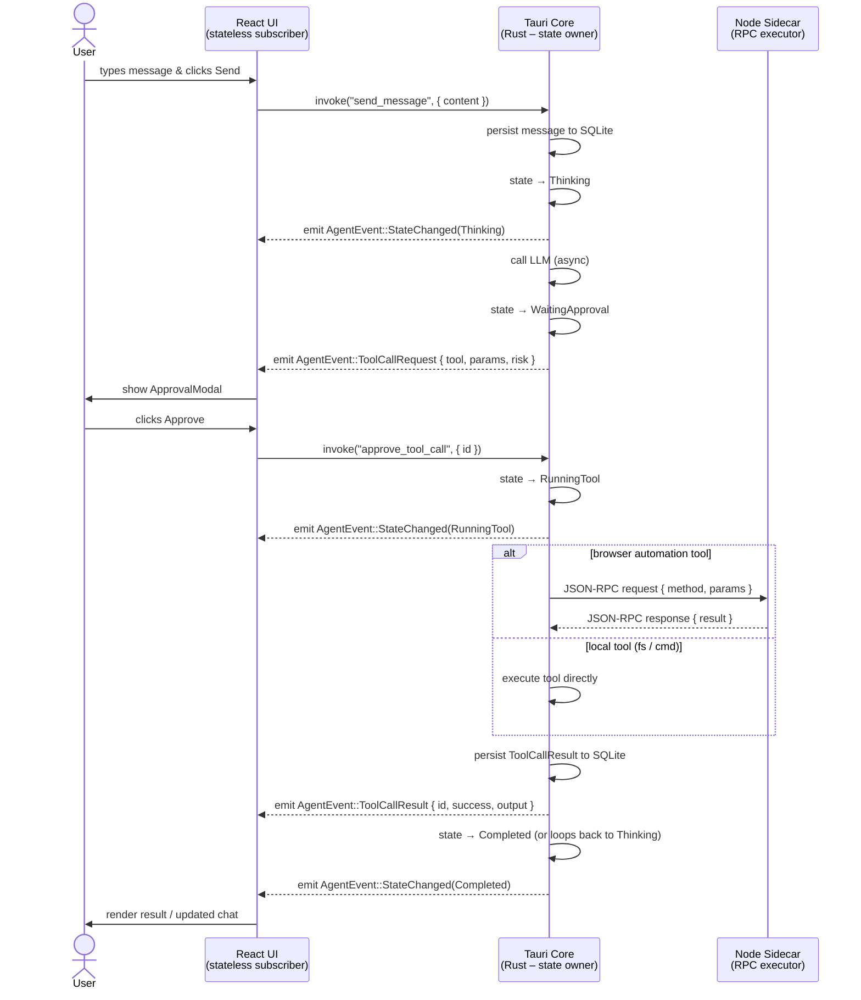

# Architecture

## Overview

myExtBot is a Windows-first "digital twin" desktop bot, structured as:

```
┌──────────────────────────────────────────────────────┐
│  Tauri Desktop App (apps/desktop)                    │
│                                                      │
│  ┌──────────────┐    ┌──────────────────────────┐   │
│  │  React UI    │◄───│  Rust Event Bus           │   │
│  │  (Vite)      │    │  (Tauri IPC / agent-event)│   │
│  └──────┬───────┘    └──────────┬───────────────┘   │
│         │ invoke/listen         │                     │
│         │              ┌────────┴──────────┐         │
│         │              │  Agent FSM        │         │
│         │              │  (9 states)       │         │
│         │              └────────┬──────────┘         │
│         │                       │                     │
│         │              ┌────────┴──────────┐         │
│         │              │  Planner (LLM)    │         │
│         │              │  → AgentPlan      │         │
│         │              └────────┬──────────┘         │
│         │                       │                     │
│         │              ┌────────┴──────────┐         │
│         │              │  Executor (LLM)   │         │
│         │              │  → tool dispatch  │         │
│         │              └────────┬──────────┘         │
│         │                       │                     │
│         │              ┌────────┴──────────┐         │
│         │              │  Tool Registry    │         │
│         │              │  + Permissions    │         │
│         │              └────────┬──────────┘         │
│         │                       │                     │
│         │              ┌────────┴──────────┐         │
│         │              │  Audit DB         │         │
│         │              │  (SQLite)         │         │
│         │              └───────────────────┘         │
└─────────┼────────────────────────────────────────────┘
          │ WebSocket JSON-RPC (planned)
          ▼
┌──────────────────────────────────┐
│  Playwright Sidecar              │
│  (services/playwright-sidecar)   │
│  Node.js + Playwright            │
└──────────────────────────────────┘
          │
          ▼
    Browser (Chromium)
```

## Single Source of Truth

The system enforces a strict **Single Source of Truth** principle across the three runtime layers:

| Layer | Role |
|-------|------|
| **Rust (Tauri Core)** | Owns and drives the agent state machine. No other layer may mutate state directly. |
| **React UI** | Stateless subscriber. Renders whatever state the Rust core emits via events. Never holds authoritative state of its own. |
| **Node Playwright Sidecar** | Passive executor. Accepts JSON-RPC commands from Rust core and returns results; never initiates actions autonomously. |

### Agent State Machine (Rust)

```
Idle ──► Thinking ──► WaitingApproval ──► RunningTool ──► Completed
  ▲                        │                   │               │
  │                        ▼                   ▼               │
  └──────────────────── Stopped ◄──────────  Failed ◄──────────┘
```

- **Idle** – No active task.
- **Thinking** – LLM call in-flight; the agent is reasoning about the next action.
- **WaitingApproval** – A `ToolCallRequest` has been proposed; waiting for user approval via the `ApprovalModal`.
- **RunningTool** – An approved tool call is being executed.
- **Stopped** – Emergency stop was triggered; all in-flight operations cancelled.
- **Completed** – The current task finished successfully.
- **Failed** – An unrecoverable error occurred.

Only Rust transitions the state machine. React displays the current state; the sidecar is told to act only when Rust issues an RPC command.

## Modules

### apps/desktop/src-tauri/src/

| Module | Purpose |
|--------|---------|
| `events.rs` | Typed event model for UI subscription (`AgentEvent` enum) |
| `events.rs` | Typed event model for UI subscription (AgentEvent enum) |
| `agent.rs` | Agent state machine (Idle/Thinking/WaitingApproval/RunningTool/Stopped/Completed/Failed) |
| `tools/` | Tool registry, JSON schema validation, and tool implementations |
| `permissions.rs` | Allowlist checking + session-scoped permit cache |
| `audit.rs` | SQLite-backed audit logging |
| `commands.rs` | Tauri IPC commands (`send_message`, `emergency_stop`, `approve`/`deny`) |
| `commands.rs` | Tauri IPC commands (send_message, emergency_stop, approve/deny) |
| Module | Purpose | Status |
|--------|---------|--------|
| `events.rs` | Typed event model — `AgentEvent` enum, `AgentStatus`, `AgentPlan`, etc. | ✅ Complete |
| `agent.rs` | 9-state FSM with oneshot approval channels for plan and tool calls | ✅ Complete |
| `llm.rs` | OpenAI-compatible client — `chat_completion`, zeroizing `ApiKey`, `LlmError` | ✅ Complete |
| `planner.rs` | `run_planner()` — single LLM call produces a structured `AgentPlan` | ✅ Complete |
| `executor.rs` | `run_executor()` — topological step traversal, per-step LLM, approval gate | ✅ Complete |
| `commands.rs` | Tauri IPC: `send_message`, `approve/deny_plan`, `approve/deny_tool_call`, `get_audit_log` | ✅ Complete |
| `permissions.rs` | Session-scoped permit cache; static allowlists not yet wired | 🔶 Partial |
| `audit.rs` | SQLite (5 tables) — sessions, messages, tool_calls, artifacts, llm_calls | ✅ Complete |
| `tools/` | Registry + JSON Schema validation + 8 tool definitions | ✅ Registry; tools partial |

### apps/desktop/src/ (React)

| Component | Purpose | Status |
|-----------|---------|--------|
| `ChatPanel` | User/assistant chat messages | ✅ Complete |
| `PlanPanel` | Live execution plan progress | ✅ Complete |
| `ApprovalModal` | Tool-call approval dialog | ✅ Complete |
| `PlanApprovalModal` | Plan approval dialog (new) | ✅ Complete |
| `AuditTimeline` | Real-time audit event stream | ✅ Complete |
| `AgentLogPanel` | Agent thinking + tool results | ✅ Complete |
| `EmergencyStop` | One-click agent halt | ✅ Complete |
| `useEventStream` | Tauri event listener hook | ✅ Complete |

### services/playwright-sidecar/

WebSocket JSON-RPC 2.0 server. The Tauri backend connects as a client and invokes browser automation via structured method calls. Currently a scaffold — method implementations are placeholders.

## Agent FSM

```
Idle ──────────────────────────────────────► Planning
                                                │
                              ┌─────────────────┴──── Failed
                              │
                              ▼
                       WaitingPlanApproval
                         │         │
                    deny │         │ approve
                         ▼         ▼
                        Idle     Thinking ◄──────────────────────┐
                                   │                              │
                        ┌──────────┴────────────┐                │
                        │                       │                 │
                        ▼                       ▼                 │
                  WaitingApproval          Completed              │
                    │       │                                     │
               deny │       │ approve                            │
                    ▼       ▼                                     │
                 Thinking  RunningTool ──────────────────────────┘
                              │
                              ▼
                           Completed / Failed

Any state ──► Stopped (emergency stop)
Stopped  ──► Idle
```

| State | Meaning |
|-------|---------|
| `Idle` | Waiting for user input |
| `Planning` | Planner LLM call in progress |
| `WaitingPlanApproval` | Plan generated, waiting for user to approve/cancel |
| `Thinking` | Executor LLM call in progress for a specific step |
| `WaitingApproval` | Tool call proposed, waiting for user approval |
| `RunningTool` | Tool executing |
| `Completed` | All steps done |
| `Failed` | Unrecoverable error |
| `Stopped` | Emergency stop triggered |

## Message Flow

```
User types message
    → React invoke("send_message")
    → Rust: log to audit DB, emit ChatMessage
    → transition: Idle → Planning
    → emit: PlanningStarted
    → Planner LLM call → AgentPlan
    → emit: PlanReady { plan }
    → transition: Planning → WaitingPlanApproval
    → React shows PlanApprovalModal
    → User clicks "批准执行" → invoke("approve_plan")
    → transition: WaitingPlanApproval → Thinking
    → Executor loops over plan.steps (topological order):
        → Executor LLM call → ToolCall { name, arguments }
        → transition: Thinking → WaitingApproval
        → emit: ToolCallRequest
        → React shows ApprovalModal
        → User approves → invoke("approve_tool_call")
        → transition: WaitingApproval → RunningTool
        → Tool dispatched, result captured
        → emit: ToolCallResult
        → audit DB updated
        → transition: RunningTool → Thinking (next step)
    → All steps done → transition: → Completed
```

## Sequence Diagram

The following Mermaid diagram illustrates the full message flow between the three layers for a typical tool-call cycle:



## Sequence Diagram

The following Mermaid diagram illustrates the full message flow between the three layers for a typical tool-call cycle:


