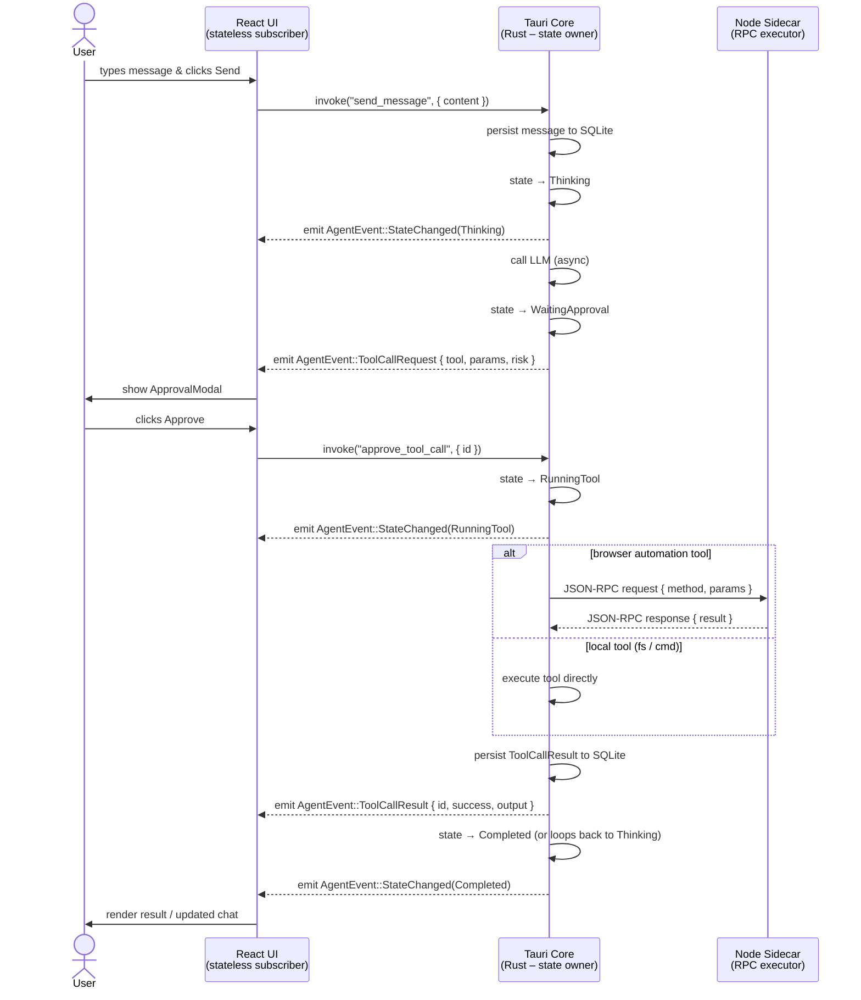

# Architecture

## Overview

myExtBot is a Windows-first "digital twin" desktop bot, structured as:

```
┌──────────────────────────────────────────────────┐
│  Tauri Desktop App (apps/desktop)                │
│                                                  │
│  ┌──────────────┐    ┌──────────────────────┐   │
│  │  React UI    │◄───│  Rust Event Bus       │   │
│  │  (Vite)      │    │  (Tauri IPC)          │   │
│  └──────┬───────┘    └──────────┬───────────┘   │
│         │ invoke/listen         │                 │
│         │              ┌────────┴──────────┐     │
│         │              │  Agent State      │     │
│         │              │  Machine (Rust)   │     │
│         │              └────────┬──────────┘     │
│         │                       │                 │
│         │              ┌────────┴──────────┐     │
│         │              │  Tool Registry    │     │
│         │              │  + Permissions    │     │
│         │              └────────┬──────────┘     │
│         │                       │                 │
│         │              ┌────────┴──────────┐     │
│         │              │  Audit DB         │     │
│         │              │  (SQLite)         │     │
│         │              └───────────────────┘     │
└─────────┼────────────────────────────────────────┘
          │ WebSocket JSON-RPC
          ▼
┌──────────────────────────────────┐
│  Playwright Sidecar              │
│  (services/playwright-sidecar)   │
│  Node.js + Playwright            │
└──────────────────────────────────┘
          │
          ▼
    Browser (Chromium)
```

## Single Source of Truth

The system enforces a strict **Single Source of Truth** principle across the three runtime layers:

| Layer | Role |
|-------|------|
| **Rust (Tauri Core)** | Owns and drives the agent state machine. No other layer may mutate state directly. |
| **React UI** | Stateless subscriber. Renders whatever state the Rust core emits via events. Never holds authoritative state of its own. |
| **Node Playwright Sidecar** | Passive executor. Accepts JSON-RPC commands from Rust core and returns results; never initiates actions autonomously. |

### Agent State Machine (Rust)

```
Idle ──► Thinking ──► WaitingApproval ──► RunningTool ──► Completed
  ▲                        │                   │               │
  │                        ▼                   ▼               │
  └──────────────────── Stopped ◄──────────  Failed ◄──────────┘
```

- **Idle** – No active task.
- **Thinking** – LLM call in-flight; the agent is reasoning about the next action.
- **WaitingApproval** – A `ToolCallRequest` has been proposed; waiting for user approval via the `ApprovalModal`.
- **RunningTool** – An approved tool call is being executed.
- **Stopped** – Emergency stop was triggered; all in-flight operations cancelled.
- **Completed** – The current task finished successfully.
- **Failed** – An unrecoverable error occurred.

Only Rust transitions the state machine. React displays the current state; the sidecar is told to act only when Rust issues an RPC command.

## Modules

### apps/desktop/src-tauri/src/

| Module | Purpose |
|--------|---------|
| `events.rs` | Typed event model for UI subscription (`AgentEvent` enum) |
| `agent.rs` | Agent state machine (Idle/Thinking/WaitingApproval/RunningTool/Stopped/Completed/Failed) |
| `tools/` | Tool registry, JSON schema validation, and tool implementations |
| `permissions.rs` | Allowlist checking + session-scoped permit cache |
| `audit.rs` | SQLite-backed audit logging |
| `commands.rs` | Tauri IPC commands (`send_message`, `emergency_stop`, `approve`/`deny`) |

### apps/desktop/src/ (React)

| Component | Purpose |
|-----------|---------|
| `ChatPanel` | Displays chat messages from user and agent |
| `PlanPanel` | Displays the current agent execution plan |
| `ApprovalModal` | Requests user approval for proposed tool calls |
| `AuditTimeline` | Streams audit events in real time |
| `EmergencyStop` | One-click agent halt button |

### services/playwright-sidecar/

WebSocket JSON-RPC 2.0 server. The Tauri backend connects as a client and invokes browser automation via structured method calls.

## Message Flow

```
User types message
    → React sends invoke("send_message")
    → Rust logs to audit DB, emits ChatMessage event
    → Agent transitions to Thinking
    → LLM call (future)
    → Agent proposes ToolCallRequest
    → AgentEvent::ToolCallRequest emitted to UI
    → ApprovalModal shown
    → User approves → invoke("approve_tool_call")
    → Agent transitions to RunningTool
    → Tool executed (with allowlist check)
    → ToolCallResult emitted
    → Audit DB updated
    → Agent transitions to Completed or loops
```

## Sequence Diagram

The following Mermaid diagram illustrates the full message flow between the three layers for a typical tool-call cycle:


